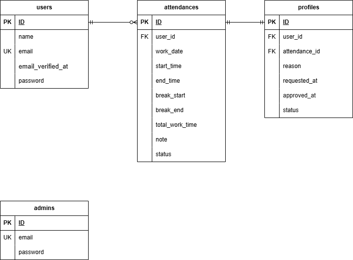

# coachtech フリマアプリ

## 環境構築

**Docker ビルド**

1. `git clone git@github.com:YAMADAMASAYUKI516/mock-project2.git`
2. DockerDesktop アプリを立ち上げる
3. `docker-compose up -d --build`

**Laravel 環境構築**

1. `docker-compose exec php bash`
2. `composer install`
3. 「.env.example」ファイルを「.env」としてコピーまたはリネーム
4. .env に以下の環境変数を追加

```text
DB_CONNECTION=mysql
DB_HOST=mysql
DB_PORT=3306
DB_DATABASE=laravel_db
DB_USERNAME=laravel_user
DB_PASSWORD=laravel_pass
```

```text
MAIL_MAILER=smtp
MAIL_HOST=mailhog
MAIL_PORT=1025
MAIL_USERNAME=null
MAIL_PASSWORD=null
MAIL_ENCRYPTION=null
MAIL_FROM_ADDRESS=example@example.com
MAIL_FROM_NAME=Tester
```

5. アプリケーションキーの作成

```bash
php artisan key:generate
```

6. マイグレーションの実行

```bash
php artisan migrate
```

7. シーディングの実行

```bash
php artisan db:seed
```

**テスト環境の準備**

1. 「.env.testing」 ファイルを「.env」からコピー

```bash
cp .env .env.testing
```

2. .env.testing の以下の環境変数を変更

```text
APP_ENV=testing
APP_KEY=
```

```text
DB_CONNECTION=mysql
DB_HOST=mysql
DB_PORT=3306
DB_DATABASE=demo_test
DB_USERNAME=root
DB_PASSWORD=root
```

3. テスト用データベースを作成

```bash
docker-compose exec mysql bash
mysql -u root -p
CREATE DATABASE demo_test;
```

4. テスト用アプリケーションキーの作成

```bash
php artisan key:generate --env=testing
```

必要に応じてキャッシュをクリアしてください
`php artisan config:clear`

5. テスト用マイグレーションの実行

```bash
php artisan migrate --env=testing
```

6. テストの実行

```bash
php artisan test
```

## 管理者の設定

```text
メールアドレス：admin@example.com
パスワード：password
```

## 使用技術(実行環境)

- PHP8.3.0
- Laravel8.83.8
- MySQL8.0.26

## ER 図



## URL

- 開発環境：http://localhost/
- phpMyAdmin：http://localhost:8080/
- Mailhog： http://localhost:8025/
